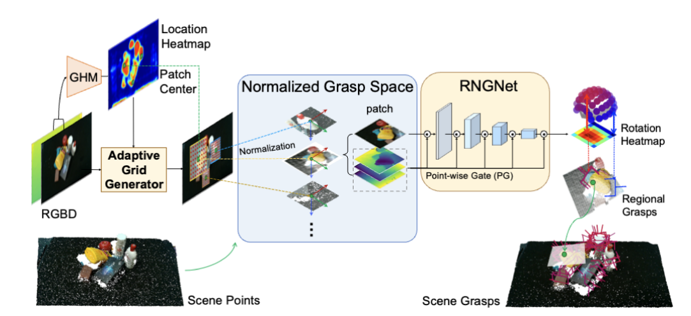

<h2 align="center">
  <b>Region-aware Grasp Framework with Normalized Grasp Space for Efficient 6-DoF Grasping</b>

<b><i>CoRL 2024</i></b>

<div align="center">
    <a href="https://openreview.net/forum?id=jPkOFAiOzf" target="_blank">
    </a>
    <a href="https://www.youtube.com/watch?v=RyozevPocX4" target="_blank">
    </a>
    <a href="https://www.bilibili.com/video/BV1kcyfYpEro/" target="_blank">
    </a>
</div>
</h2>

Official code of paper [Region-aware Grasp Framework with Normalized Grasp Space for Efficient 6-DoF Grasping](https://openreview.net/forum?id=jPkOFAiOzf)

The codebase is mainly built based on our former work [HGGD](https://github.com/THU-VCLab/HGGD). It is highly recommended to read and run [HGGD](https://github.com/THU-VCLab/HGGD) before using this repo.

# Framework



# Requirements

- Python >= 3.8
- PyTorch >= 1.10
- pytorch3d
- numpy==1.23.5
- pandas
- cupoch
- numba
- grasp_nms
- matplotlib
- open3d
- opencv-python
- scikit-image
- tensorboardX
- torchsummary
- tqdm
- transforms3d
- trimesh
- autolab_core
- cvxopt

## Installation

This code has been tested on Ubuntu20.04 with Cuda 11.1/11.3/11.6, Python3.8/3.9 and Pytorch 1.11.0/1.12.0.

Get the code.

```bash
git clone https://github.com/THU-VCLab/RegionNormalizedGrasp.git
```

Create new Conda environment.

```bash
conda create -n rngnet python=3.8
cd RegionNormalizedGrasp
```

Please install [pytorch](https://pytorch.org/) and [pytorch3d](https://github.com/facebookresearch/pytorch3d/blob/main/INSTALL.md) manually.

```bash
# pytorch-1.11.0
pip install torch==1.11.0+cu113 torchvision==0.12.0+cu113 torchaudio==0.11.0 --extra-index-url https://download.pytorch.org/whl/cu113
# pytorch3d
pip install fvcore
pip install --no-index --no-cache-dir pytorch3d -f https://dl.fbaipublicfiles.com/pytorch3d/packaging/wheels/py38_cu113_pyt1110/download.html
```

Install other packages via Pip.

```bas
pip install -r requirements.txt
```

# Usage

## Checkpoint

Checkpoints are located in the [folder](./checkpoints/)

## Preprocessed Dataset of HGGD

Preprocessed datasets (realsense.7z/kinect.7z) can be downloaded from [Tsinghua Cloud](https://cloud.tsinghua.edu.cn/d/e3edfc2c8b114513b7eb/)

Containing converted and refined grasp poses from each image in graspnet dataset

## Train

Training code will be released with our pre-processed patch-level grasp dataset.

<!-- Training code has been released, please refer to [training script](./train_graspnet.sh)

Typical hyperparameters:

```shell
batch-size # batch size, default: 4
step-cnt # step number for gradient accumulation, actual_batch_size = batch_size * step_cnt, default: 2
lr # learning rate, default: 1e-2
anchor-num # spatial rotation anchor number, default: 7
anchor-k # in-plane roation anchor number, default: 6
anchor-w # grasp width anchor size, default: 50
anchor-z # grasp depth anchor size, default: 20
all-points-num # point cloud downsample number, default: 25600
group-num # local region fps number, default: 512
center-num # sampled local center/region number, default: 128
noise # point cloud noise scale, default: 0
ratio # grasp attributes prediction downsample ratio, default: 8
grid-size # grid size for our grid-based center sampling, default: 8
scene-l & scene-r # scene range, train: 0~100, seen: 100~130, similar: 130~160, novel: 160~190
input-w & input-h # downsampled input image size, should be 640x360
loc-a & reg-b & cls-c & offset-d # loss multipier, default: 1, 5, 1, 1
epochs # training epoch number, default: 15
num-workers # dataloader worker number, default: 4
save-freq # checkpoint saving frequency, default: 1
optim # optimizer, default: 'adamw'
dataset-path # our preprocessed dataset path (read grasp poses)
scene-path  # original graspnet dataset path (read images)
joint-trainning # whether to joint train our two part of network (trainning is a typo, should be training, please ignore it)
``` -->

## Test

Download and unzip our preprocessed datasets (for convenience), you can also try removing unnecessary parts in our test code and directly reading images from the original graspnet dataset api.

Run test code (read rgb and depth image from graspnet dataset and eval grasps).

```bash
bash test_graspnet.sh
```

Attention: if you want to change camera, please remember to change `camera` in [config.py](./dataset/config.py)

Typical hyperparameters:

```python
center-num # sampled local center/region number, higher number means more regions&grasps, but gets slower speed, default: 48
embed-dim # network width, default: 256
patch-size # patch size for RNGNet, default: 64
local-k # grasp detection number in each local region, default: 10
scene-l & scene-r # scene range, train: 0~100, seen: 100~130, similar: 130~160, novel: 160~190
input-h & input-w # downsampled input image size, should be 640x360
local-thres & heatmap-thres # heatmap and grasp score filter threshold, set to 0.01 in our settings
dataset-path # our preprocessed dataset path (read grasp poses)
scene-path # original graspnet dataset path (read images)
num-workers # eval worker number
dump-dir # detected grasp poses dumped path (used in later evaluation)
```

## Demo

Run demo code (read rgb and depth image from file and get grasps).

```bash
bash demo.sh
```

Typical hyperparameters:

```python
center-num # sampled local center/region number, higher number means more regions&grasps, but gets slower speed, default: 48
embed-dim # network width, default: 256
patch-size # patch size for RNGNet, default: 64
```

# Citation

Please cite our paper in your publications if it helps your research:

```
@inproceedings{
chen2024regionaware,
title={Region-aware Grasp Framework with Normalized Grasp Space for Efficient 6-DoF Grasping},
author={Siang Chen and Pengwei Xie and Wei Tang and Dingchang Hu and Yixiang Dai and Guijin Wang},
booktitle={8th Annual Conference on Robot Learning},
year={2024},
url={https://openreview.net/forum?id=jPkOFAiOzf}
}
```
